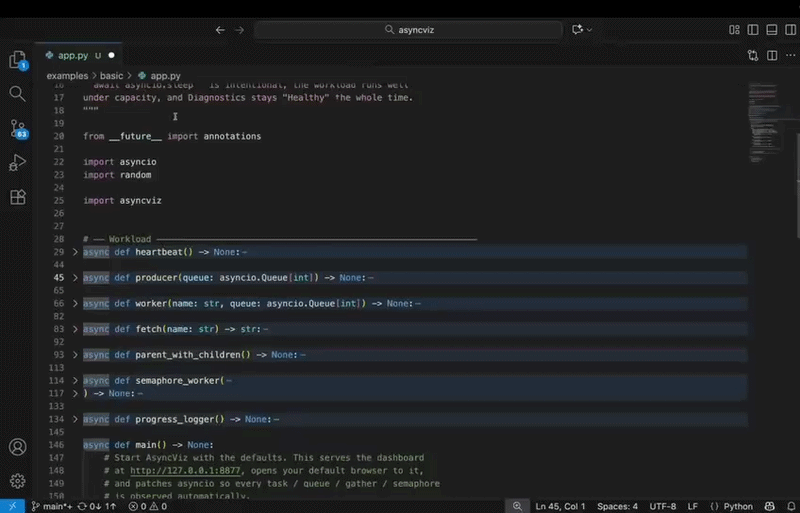
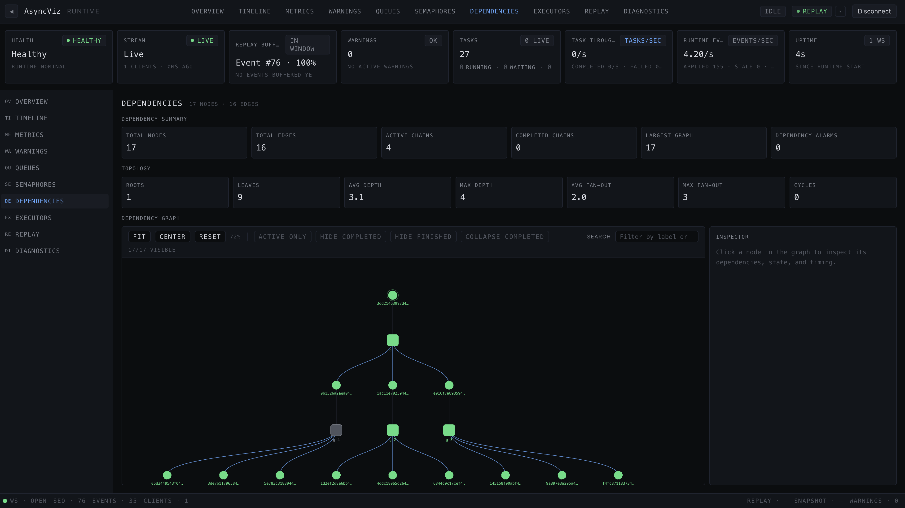
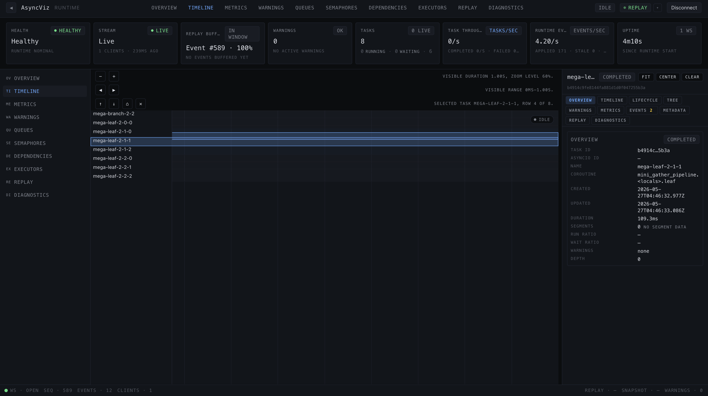
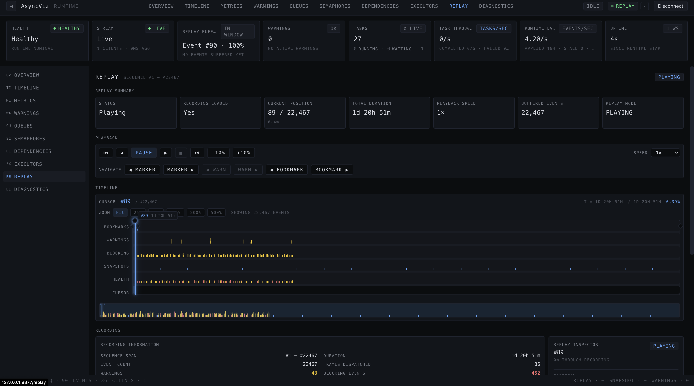
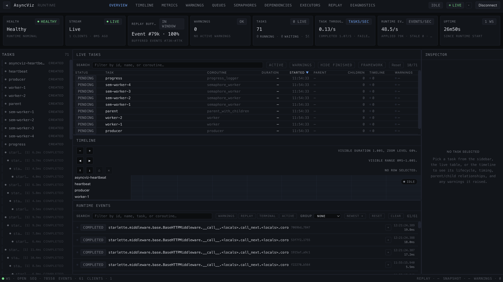
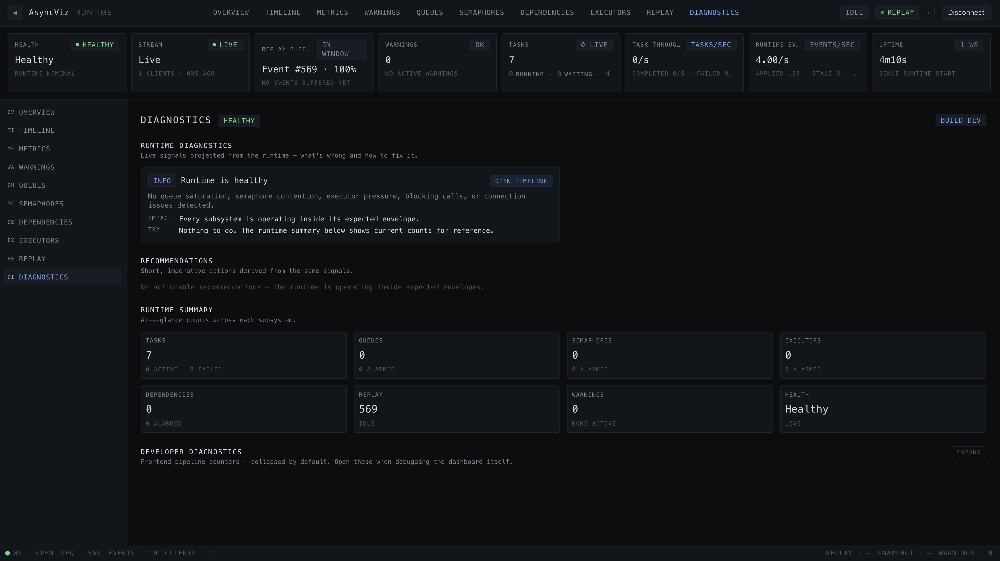

# AsyncViz

**Visual debugging for Python asyncio applications.**

Debugging asyncio is hard.

Tasks appear and disappear.
Queues silently fill up.
Blocking operations freeze the event loop.
Dependencies become impossible to follow.

Most of the time, you're left staring at logs and trying to guess what happened.

AsyncViz makes asyncio visible.

Run your application and instantly see what it is doing in real time—tasks, queues, semaphores, executors, and await relationships, all visualized in your browser.

* Task lifecycle visualization
* Dependency tracking
* Queue observability
* Executor monitoring
* Blocking detection
* Runtime recording and replay

```bash
pip install asyncviz

asyncviz run app.py
```



---

## Why AsyncViz?

Traditional debugging tools tell you what happened.

AsyncViz shows you what is happening.

Instead of reading logs and stack traces, you can watch tasks being created, scheduled, executed, blocked, cancelled, and completed as your application runs.

Whether you're learning asyncio, debugging production issues, or teaching asynchronous programming, AsyncViz provides visibility that Python developers typically don't have.

---

## Features

### Realtime Task Visualization

See task creation, execution, completion, cancellation, and scheduling activity as it happens.

Track how work moves through your application in real time.

---

### Dependency Graphs

Understand task relationships and execution flow.

Visualize:

* Parent-child task trees
* Gather fan-outs
* Dependency chains
* Runtime relationships



---

### Queue Observability

Monitor queue behavior and pressure.

Track:

* Queue occupancy
* Queue saturation
* Producer activity
* Consumer activity
* Backpressure patterns

---

### Blocking Detection

Find operations that freeze the event loop.

AsyncViz detects:

* Event-loop stalls
* Blocking calls
* Freeze windows
* Runtime slowdowns

and highlights them directly inside the dashboard.

---

### Executor Monitoring

Observe:

* ThreadPoolExecutor activity
* ProcessPoolExecutor activity
* Queue depth
* Utilization
* Failures
* Slow jobs

---

### Timeline View

Explore application execution through an interactive timeline.

Visualize:

* Task creation
* Task execution
* Completion
* Cancellation
* Blocking regions

Supports:

* Zoom
* Pan
* Virtualized rendering
* Large runtime sessions



---

### Runtime Recording & Replay

Capture a session and step through it later inside the dashboard.

```bash
asyncviz record app.py
asyncviz replay session-<timestamp>.avz
```

`asyncviz record` writes a portable `.avz` bundle containing every event from the run. `asyncviz replay` opens the same dashboard against that bundle, with playback controls, a lane-based timeline, scrubbing, bookmarks, and selection statistics — so the captured session can be inspected and shared without rerunning the application.



---

## Installation

Requirements:

* Python 3.12+

Install from PyPI:

```bash
pip install asyncviz
```

---

## Quick Start

Run any asyncio script through the CLI:

```bash
asyncviz run app.py
```

…or call AsyncViz from your own code with a single function:

```python
import asyncviz

asyncviz.start()
```

Either path opens the dashboard at <http://127.0.0.1:8877> and streams live runtime activity into it.

A complete, runnable example lives under [`examples/basic/`](examples/basic/) — start there to see every dashboard page come to life.

---

## Dashboard

AsyncViz includes a built-in dashboard with dedicated views for different aspects of runtime behavior.

### Overview

High-level runtime activity and health.



### Timeline

Task execution over time.

### Warnings

Blocking operations and runtime issues.

### Queues

Queue activity and pressure.

### Semaphores

Permit usage, waiters, and contention.

### Dependencies

Task relationships and execution graphs.

### Executors

Executor activity and performance.

### Metrics

Aggregate throughput, event rates, task counts, and runtime statistics.

### Replay

Playback of recorded sessions, with scrubbing, bookmarks, and selection statistics.

### Diagnostics

Findings, recommendations, and per-subsystem health, explained in plain language.



---

## Architecture

AsyncViz consists of:

- Runtime instrumentation
- Live event streaming
- Embedded web dashboard
- Recording engine
- Replay engine

The dashboard connects to the running application through a live event stream and updates continuously as execution progresses.

---

## Use Cases

### Learning Asyncio

Understand how tasks are scheduled and executed.

### Teaching Asyncio

Demonstrate runtime behavior visually.

### Debugging

Identify bottlenecks, blocking operations, and execution issues.

### Performance Analysis

Inspect runtime behavior and execution flow.

### Development

Gain visibility into asynchronous systems during local development.

---

## Roadmap

Future work being considered for upcoming releases:

* Historical comparison between sessions
* Advanced filtering across pages
* Broader search capabilities
* Export of dashboard views and recordings
* Enhanced analytics on captured sessions

---

## Contributing

Contributions are welcome.

Bug reports, feature requests, documentation improvements, and pull requests are all appreciated.

See CONTRIBUTING.md for development guidelines.

---

## License

MIT License.
